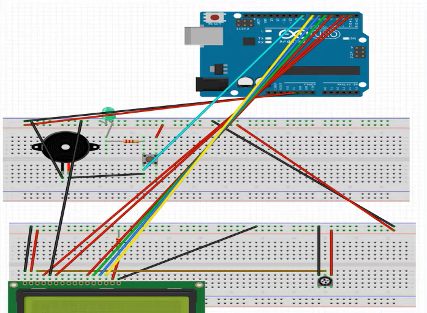

# Arduino UNO Morse Code Encrypter

 **Arduino UNO Morse Code Encrypter** project! This project allows you to encode text into Morse code and output it using an Arduino.
---

### **Features**
- **Encode text to Morse code**: Type any message and get the corresponding Morse code.
- **Real-time output**: Watch your encoded message come to life on an LED, buzzer, or any other output device.
- **User-friendly interface**: Simple and interactive.

---

### **Installation**

To get started with the **Arduino UNO Morse Code Encrypter**, follow these simple steps:

1. **Clone the repository**:

   ```bash
   git clone https://github.com/manas-gupta-3131/Arduino-UNO-Morse-code-encrypter.git
